# PROJECT MAP - STUDIO AGENT CLIENT (APPLE-CENTRIC AI WORKSPACE)

## Arquitectura del Sistema (Mermaid Graph)

```mermaid
graph TD
    User([Usuario Multi-dispositivo: Mac, iPad, iPhone, Android, PC]) --> WebApp[Studio Agent WebApp]
    
    subgraph UI_UX [UI / UX Apple-Centric & Mobile-First]
        Nav[Dynamic Island, Sync Badge & Navigation Bar]
        ZenToggle[Zen Mode / Mobile Sidebar Sheet Toggle]
        Sidebar[Barra Lateral: Proyectos, Carpetas, Chats, Tags & Pins]
        ChatArea[Área de Conversación con SSE Streaming & Live Step Timeline]
        InputDock[Smart Input: Slash / Commands, Attachment Dock & Prompts]
        CanvasRight[Side View: Iframe Live Preview, Multi-Device & Diff Slider]
        Debugger[Floating Debugger: Logs de Consola y API Dify]
        CmdModal[Modal Gestor CRUD de Comandos y Atajos]
        PromptModal[Modal Gestor CRUD de Biblioteca de Prompts]
        SearchModal[Modal Búsqueda Global con Botón de Cierre & Esc]
        ExportModal[Descarga de Carpetas ZIP y Exportación de Workspace]
        SettingsModal[Configuración de API, Supabase Cloud & User ID Sync]
    end

    subgraph Core_Engine [Motor de Lógica Frontend & Persistencia]
        Store[Local Storage & State Engine Reactivo - state.js]
        CloudSync[Cloud Sync Engine: Supabase Cloud Storage & REST + Universal Gist Fallback - sync.js]
        DifyClient[Dify SSE Client & Action Humanizer - dify.js]
        SlashHandler[Slash / Autocomplete & In-Place Cursor Inserter]
        FileEngine[Client Compressor & Multi-upload Manager]
        CanvasEngine[Live Device Frame & Code Previewer - canvas.js]
        ExportEngine[Folder & Project Zip Exporter - JSZip]
    end

    subgraph Remote_Services [Servicios Remotos]
        DifyAPI[Dify API v1: /chat-messages, /files/upload, /messages]
        SupabaseStorage[Supabase Cloud Bucket: /storage/v1/object/agent-files/workspaces/]
        SupabaseDB[Supabase PostgreSQL DB: /rest/v1/workspaces]
        GistCloudDB[GitHub Cloud Storage API: /gists Fallback Store]
    end

    WebApp --> Nav
    WebApp --> Sidebar
    WebApp --> ChatArea
    WebApp --> InputDock
    WebApp --> CanvasRight
    WebApp --> Debugger
    WebApp --> CmdModal
    WebApp --> PromptModal
    WebApp --> SearchModal
    WebApp --> ExportModal
    WebApp --> SettingsModal

    InputDock --> SlashHandler
    InputDock --> FileEngine
    ChatArea --> DifyClient
    DifyClient <-->|SSE Stream / HTTPS| DifyAPI
    Store <--> CloudSync
    CloudSync <-->|Storage Bucket Sync JSON| SupabaseStorage
    CloudSync <-->|REST API JSON| SupabaseDB
    CloudSync <-->|JSON Gist REST Sync| GistCloudDB
    FileEngine -->|Upload| DifyAPI
    Store <--> WebApp
    ExportEngine <--> Store
```

## Componentes y Módulos
1. **Supabase & Universal Cloud Sync Engine (`js/sync.js`):** Sincronización multi-dispositivo y multi-navegador en tiempo real conectada a Supabase (Bucket `agent-files/workspaces/` y REST API) con detección inteligente de hashes y fallback universal.
2. **State Management Reactivo (`js/state.js`):** Gestión de estado local y remoto unificado con credenciales por defecto de Supabase inyectadas para sincronización inmediata 'out of the box'.
3. **Panel de Ajustes Multi-dispositivo (`index.html`, `js/app.js`):** Configuración visual e indicación del estado de conexión activa de Supabase Cloud Sync y selector de User ID unificado.
4. **Multi-Device & Mobile Optimization (`css/style.css`, `index.html`, `js/app.js`):** Interfaz táctil adaptada para celulares y tablets con drawer deslizante, overlay y botones con visibilidad optimizada en pantallas táctiles.
5. **Gestión de Proyectos & Selección en Cualquier Pantalla (`js/state.js`, `js/app.js`):** Renderizado reactivo instantáneo cuando llegan datos de Supabase o la nube.
6. **Modal Manager Accesible (`js/app.js`, `index.html`):** Cierre accesible en modales por backdrop, botón de cierre y tecla Escape.
7. **Side View Multi-Device Responsive (`js/canvas.js`):** Previsualización en iframe con resoluciones Desktop (100%), Tablet (768px) y Móvil (375px).
8. **Timeline de Acciones del Agente en Vivo:** Visualización de pasos humanizados con iconos y detalles contextuales.
9. **Smart Input & Slash Interceptor:** Inserción quirúrgica de atajos y prompts en la posición actual del cursor sin borrar el texto ingresado.
10. **Biblioteca de Prompts & Gestor de Atajos (CRUD Completo):** Edición, creación y eliminación en tiempo real con persistencia en Supabase.
