# PROJECT MAP - STUDIO AGENT CLIENT (APPLE-CENTRIC AI WORKSPACE)

## Arquitectura del Sistema (Mermaid Graph)

```mermaid
graph TD
    User([Usuario Multi-dispositivo: Mac, iPad, iPhone, Android, PC]) --> WebApp[Studio Agent WebApp]
    
    subgraph UI_UX [UI / UX Apple-Centric & Mobile-First]
        Nav[Dynamic Island, Sync Badge & Navigation Bar]
        ZenToggle[Zen Mode / Mobile Sidebar Sheet Toggle]
        Sidebar[Barra Lateral: Proyectos, Carpetas, Chats, Tags & Pins]
        ChatArea[Área de Conversación con SSE Streaming & Live Step Timeline]
        InputDock[Smart Input: Slash / Commands, Attachment Dock & Prompts]
        CanvasRight[Side View: Iframe Live Preview, Multi-Device & Diff Slider]
        Debugger[Floating Debugger: Logs de Consola y API Dify]
        CmdModal[Modal Gestor CRUD de Comandos y Atajos]
        PromptModal[Modal Gestor CRUD de Biblioteca de Prompts]
        SearchModal[Modal Búsqueda Global con Botón de Cierre & Esc]
        ExportModal[Descarga de Carpetas ZIP y Exportación de Workspace]
        SettingsModal[Configuración de API, Supabase & User ID Sync]
    end

    subgraph Core_Engine [Motor de Lógica Frontend & Persistencia]
        Store[Local Storage & State Engine Reactivo]
        CloudSync[Cloud Sync Engine: Supabase REST Realtime + Universal Gist Fallback]
        DifyClient[Dify SSE Client & Action Humanizer]
        SlashHandler[Slash / Autocomplete & In-Place Cursor Inserter]
        FileEngine[Client Compressor & Multi-upload Manager]
        ExportEngine[Folder & Project Zip Exporter - JSZip]
    end

    subgraph Remote_Services [Servicios Remotos]
        DifyAPI[Dify API v1: /chat-messages, /files/upload, /messages]
        SupabaseDB[Supabase PostgreSQL DB: /rest/v1/workspaces]
        GistCloudDB[GitHub Cloud Storage API: /gists Fallback Store]
    end

    WebApp --> Nav
    WebApp --> Sidebar
    WebApp --> ChatArea
    WebApp --> InputDock
    WebApp --> CanvasRight
    WebApp --> Debugger
    WebApp --> CmdModal
    WebApp --> PromptModal
    WebApp --> SearchModal
    WebApp --> ExportModal
    WebApp --> SettingsModal

    InputDock --> SlashHandler
    InputDock --> FileEngine
    ChatArea --> DifyClient
    DifyClient <-->|SSE Stream / HTTPS| DifyAPI
    Store <--> CloudSync
    CloudSync <-->|REST API JSON| SupabaseDB
    CloudSync <-->|JSON Gist REST Sync| GistCloudDB
    FileEngine -->|Upload| DifyAPI
    Store <--> WebApp
    ExportEngine <--> Store
```

## Componentes y Módulos
1. **Supabase & Universal Cloud Sync Engine (`js/sync.js`):** Sincronización híbrida de alta disponibilidad con Supabase PostgreSQL REST API y persistencia universal en la nube.
2. **Panel de Ajustes Multi-dispositivo (`index.html`, `js/app.js`):** Campos directos para `Supabase URL` y `Anon Key` junto con el `User ID` unificado.
3. **Multi-Device & Mobile Optimization (`css/style.css`, `index.html`, `js/app.js`):** Interfaz táctil adaptada para celulares y tablets con drawer deslizante, overlay y botones con visibilidad optimizada en pantallas táctiles.
4. **Gestión de Proyectos & Selección en Cualquier Pantalla (`js/state.js`, `js/app.js`):** Renderizado reactivo cuando llegan datos de la base de datos o de la nube.
5. **Modal Manager Accesible (`js/app.js`, `index.html`):** Botón de cierre visible en todos los modales, cierre al hacer clic en el backdrop oscuro y tecla `Escape`.
6. **Side View Multi-Device Responsive (`js/canvas.js`):** Previsualización en iframe con resoluciones Desktop (100%), Tablet (768px) y Móvil (375px).
7. **Timeline de Acciones del Agente en Vivo:** Visualización de pasos humanizados con iconos y detalles contextuales.
8. **Smart Input & Slash Interceptor:** Inserción quirúrgica de atajos y prompts en la posición actual del cursor sin borrar el texto ingresado.
9. **Biblioteca de Prompts & Gestor de Atajos (CRUD Completo):** Edición, creación y eliminación en tiempo real con persistencia en la nube.
