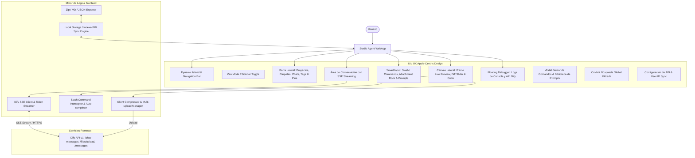

# PROJECT MAP - STUDIO AGENT CLIENT (APPLE-CENTRIC AI WORKSPACE)

## Arquitectura del Sistema (Mermaid Graph)

## Componentes y Módulos
1. **Dynamic Island & Header:** Notificaciones fluidas, selector de proyectos, token counter en tiempo real y selector de modo oscuro.
2. **Sidebar:** Estructura jerárquica (Proyectos > Carpetas > Chats), estados anclados (Pinned), tags personalizables (#DiseñoWeb, #Bugs), y archivo.
3. **Chat Feed & SSE Streaming:** Renderizado progresivo tipo Claude/ChatGPT, bloques de código interactivos con syntax highlight y botones de acción (Copiar, Reintentar, Detener, Editar).
4. **Smart Input Dock:** 
   - Autocompletado de comandos slash (`/editalasimagenes`, `/crealasimagenes`, `/combinalasimagenes`, `/variaspaginas`, `/landing`, `/creartextos`).
   - Mantenimiento estricto del texto al adjuntar archivos.
   - Attachment Dock con miniaturas y compresión en cliente.
5. **Canvas Lateral (Artifacts & Side-by-Side View):**
   - Previsualización web responsiva (Desktop 1920px, Tablet 768px, Mobile 375px).
   - Comparador interactivo Antes/Después con slider de división.
   - Navegación de archivos generados y enlaces externos.
6. **Búsqueda Global (Cmd+K) & Filtros:** Por fecha, tipo de archivo, tags y proyectos.
7. **Floating Debugger & Token Monitor:** Seguimiento de peticiones HTTP, SSE chunks, consumo de tokens y errores de API.
8. **Export Engine:** Exportación a JSON, Markdown y empaquetado masivo en ZIP.
