# PROJECT MAP - STUDIO AGENT CLIENT (APPLE-CENTRIC AI WORKSPACE)

## Arquitectura del Sistema (Mermaid Graph)

```mermaid
graph TD
    User([Usuario Global: Dani • Multi-dispositivo: Mac, iPad, iPhone, Android, PC]) --> WebApp[Studio Agent WebApp]
    
    subgraph UI_UX [UI / UX Apple-Centric & Mobile-First]
        Nav[Dynamic Island, Sync Status Bar & Navigation Bar]
        ZenToggle[Zen Mode / Mobile Sidebar Sheet Toggle]
        Sidebar[Barra Lateral: Proyectos, Carpetas, Chats con Renombrado/Edición, Tags & Pins]
        ChatArea[Área de Conversación con Smart Auto-Scroll, SSE Streaming & Live Step Timeline]
        LiveStepCard[Acciones en Vivo Expandibles & Orden Cronológico Inverso: Última Arriba]
        InputDock[Smart Input: Paste Clipboard Images/Docs, Slash / Commands, Attachment Dock & Prompts]
        StopControl[Control de Detención Inmediata & Cancelación de SSE Stream]
        CanvasRight[Side View: Iframe Live Preview, Multi-Device & Diff Slider]
        Debugger[Floating Debugger: Logs de Consola y API Dify]
        CmdModal[Modal Gestor CRUD Completo de Comandos y Atajos con Eliminación Funcional]
        PromptModal[Modal Gestor CRUD Completo de Biblioteca de Prompts con Eliminación Funcional]
        SearchModal[Modal Búsqueda Global con Botón de Cierre & Esc]
        ExportModal[Descarga de Carpetas ZIP y Exportación de Workspace]
    end

    subgraph Core_Engine [Motor de Lógica Frontend & Persistencia]
        Store[Local Storage & State Engine Reactivo - state.js: CRUD Chats, Commands, Prompts]
        CloudSync[Cloud Sync Engine Event-Driven: Sincronización por cambio y al finalizar agente - sync.js]
        DifyClient[Dify SSE Client & Action Humanizer con Manejo de AbortController y Background Execution - dify.js]
        SlashHandler[Slash / Autocomplete & In-Place Cursor Inserter]
        FileEngine[Client Compressor, Paste & Multi-upload Manager]
        CanvasEngine[Live Device Frame & Code Previewer - canvas.js]
        ExportEngine[Folder & Project Zip Exporter - JSZip]
    end

    subgraph Remote_Services [Servicios Remotos]
        DifyAPI[Dify API v1: /chat-messages, /files/upload, /messages]
        SupabaseStorage[Supabase Cloud Bucket: /storage/v1/object/agent-files/workspaces/]
        SupabaseDB[Supabase PostgreSQL DB: /rest/v1/workspaces]
        GistCloudDB[GitHub Cloud Storage API: /gists Fallback Store]
    end

    WebApp --> Nav
    WebApp --> Sidebar
    WebApp --> ChatArea
    WebApp --> LiveStepCard
    WebApp --> StopControl
    WebApp --> InputDock
    WebApp --> CanvasRight
    WebApp --> Debugger
    WebApp --> CmdModal
    WebApp --> PromptModal
    WebApp --> SearchModal
    WebApp --> ExportModal

    InputDock --> SlashHandler
    InputDock --> FileEngine
    ChatArea --> DifyClient
    DifyClient <-->|SSE Stream / HTTPS| DifyAPI
    StopControl -->|Abort Controller & Reset UI| DifyClient
    DifyClient -->|Pausa de Polling mientras actúa| CloudSync
    Store <--> CloudSync
    CloudSync <-->|Storage Bucket Sync JSON| SupabaseStorage
    CloudSync <-->|REST API JSON| SupabaseDB
    CloudSync <-->|JSON Gist REST Sync| GistCloudDB
    FileEngine -->|Upload| DifyAPI
    Store <--> WebApp
    ExportEngine <--> Store
```

## Componentes y Módulos
1. **Ejecución Ininterrumpida en Segundo Plano / Cambio de Pestañas (`js/dify.js`, `js/app.js`):** El cliente de streaming SSE mantiene su conexión activa sin abortarse ni reiniciar la UI cuando el usuario cambia de pestaña, minimiza o cambia de foco.
2. **Pausa Inteligente de Sincronización durante Respuestas del Agente (`js/sync.js`, `js/dify.js`, `js/app.js`):** `pauseSync()` y `resumeSync()` pausan la sincronización periódica mientras el agente está actuando para prevenir sobreescrituras y race conditions en el estado local, reanudándose una vez finalizada la respuesta o al detener manualmente.
3. **Acciones en Vivo con Orden Inverso y Expansión de Logs (`js/app.js`):** El timeline de acciones en vivo renderiza la acción más reciente en la parte superior y las anteriores hacia abajo; cada recuadro es clicable y expande/colapsa el log detallado de inputs, herramientas y pensamientos del agente.
4. **Botón de Detener 100% Funcional (`js/app.js`, `js/dify.js`):** El botón de detener invoca de forma segura `dify.stop()`, cancela la petición SSE vía `AbortController`, restaura la interfaz a estado de reposo y reactiva la sincronización.
5. **Edición y Renombrado de Chats en Toda la Aplicación (`js/app.js`, `js/state.js`, `index.html`):** Botón de edición y renombrado en cada chat de la barra lateral además de la barra superior.
6. **Gestión CRUD y Eliminación de Comandos y Atajos (`js/app.js`, `js/state.js`):** Soporte integral de métodos `addCommand`, `updateCommand`, `deleteCommand` y sincronización en la nube.
7. **Gestión CRUD y Eliminación de Plantillas de Prompts (`js/app.js`, `js/state.js`):** Soporte integral de métodos `addPrompt`, `updatePrompt`, `deletePrompt` y persistencia reactiva.
8. **Barra de Estado de Sincronización Dinámica (`js/sync.js`, `index.html`):** Tres estados canónicos (*"Sincronizado"*, *"Sincronizando"*, *"Offline"*) y fecha/hora precisa (`DD/MM/YYYY HH:mm:ss`).
9. **Soporte Multimodal & Pegado de Imágenes/Archivos (`js/app.js`):** Interceptor de portapapeles y subida a Dify API con vista previa rápida.
10. **Side View Multi-Device Responsive (`js/canvas.js`):** Visualización en vivo para Desktop, Tablet y Móvil con slider de comparación.
