# PROJECT MAP - STUDIO AGENT CLIENT (APPLE-CENTRIC AI WORKSPACE)

## Arquitectura del Sistema (Mermaid Graph)

```mermaid
graph TD
    User([Usuario Multi-dispositivo: iPhone, iPad, Android, Mac, PC]) --> WebApp[Studio Agent WebApp]
    
    subgraph UI_UX [UI / UX Apple-Centric & Mobile-First]
        Nav[Dynamic Island, Sync Badge & Navigation Bar]
        ZenToggle[Zen Mode / Mobile Sidebar Sheet Toggle]
        Sidebar[Barra Lateral: Proyectos, Carpetas, Chats, Tags & Pins]
        ChatArea[Área de Conversación con SSE Streaming & Live Step Timeline]
        InputDock[Smart Input: Slash / Commands, Attachment Dock & Prompts]
        CanvasRight[Side View: Iframe Live Preview, Multi-Device & Diff Slider]
        Debugger[Floating Debugger: Logs de Consola y API Dify]
        CmdModal[Modal Gestor CRUD de Comandos y Atajos]
        PromptModal[Modal Gestor CRUD de Biblioteca de Prompts]
        SearchModal[Modal Búsqueda Global con Botón de Cierre & Esc]
        ExportModal[Descarga de Carpetas ZIP y Exportación de Workspace]
        SettingsModal[Configuración de API & User ID Sync]
    end

    subgraph Core_Engine [Motor de Lógica Frontend & Persistencia]
        Store[Local Storage & State Engine con Fallback de Proyectos]
        CloudSync[Cloud Sync Engine con Multi-Device PATCH Polling & Auto-Push]
        DifyClient[Dify SSE Client & Action Humanizer]
        SlashHandler[Slash / Autocomplete & In-Place Cursor Inserter]
        FileEngine[Client Compressor & Multi-upload Manager]
        ExportEngine[Folder & Project Zip Exporter - JSZip]
    end

    subgraph Remote_Services [Servicios Remotos]
        DifyAPI[Dify API v1: /chat-messages, /files/upload, /messages]
        CloudDB[Cloud Context Sync Hub v2: RESTful PATCH User Data Store]
    end

    WebApp --> Nav
    WebApp --> Sidebar
    WebApp --> ChatArea
    WebApp --> InputDock
    WebApp --> CanvasRight
    WebApp --> Debugger
    WebApp --> CmdModal
    WebApp --> PromptModal
    WebApp --> SearchModal
    WebApp --> ExportModal

    InputDock --> SlashHandler
    InputDock --> FileEngine
    ChatArea --> DifyClient
    DifyClient <-->|SSE Stream / HTTPS| DifyAPI
    Store <--> CloudSync
    CloudSync <-->|JSON REST PATCH Sync| CloudDB
    FileEngine -->|Upload| DifyAPI
    Store <--> WebApp
    ExportEngine <--> Store
```

## Componentes y Módulos
1. **Multi-Device & Mobile Optimization (`css/style.css`, `index.html`, `js/app.js`):** Interfaz táctil adaptada para celulares con drawer deslizante, overlay, botones con visibilidad optimizada en pantallas táctiles y auto-cierre al cambiar de chat.
2. **Cloud Multi-Device Sync Engine (`js/sync.js`):** Sincronización automática de proyectos, carpetas, chats, prompts y comandos entre todos los dispositivos que usen el mismo `User ID` mediante endpoints REST v2 PATCH optimizados.
3. **Gestión de Proyectos & Selección en Cualquier Pantalla (`js/state.js`, `js/app.js`):** Renderizado garantizado con valores por defecto resilientes, activación de proyectos mediante clic/touch y persistencia local/cloud.
4. **Modal Manager Accesible (`js/app.js`, `index.html`):** Botón de cierre visible en todos los modales (incluyendo búsqueda global), cierre al hacer clic en el backdrop oscuro y tecla `Escape`.
5. **Side View Multi-Device Responsive (`js/canvas.js`):** Previsualización en iframe con resoluciones Desktop (100%), Tablet (768px) y Móvil (375px), botón para colapsar/mostrar e intercepción de enlaces del chat.
6. **Timeline de Acciones del Agente en Vivo:** Visualización de pasos humanizados con iconos y detalles contextuales.
7. **Smart Input & Slash Interceptor:** Inserción quirúrgica de atajos y prompts en la posición actual del cursor sin borrar el texto ingresado.
8. **Biblioteca de Prompts & Gestor de Atajos (CRUD Completo):** Edición, creación y eliminación en tiempo real con persistencia en la nube.
9. **Descarga de Carpetas y Proyectos en ZIP:** Empaquetado instantáneo con metadatos JSON y Markdown.
