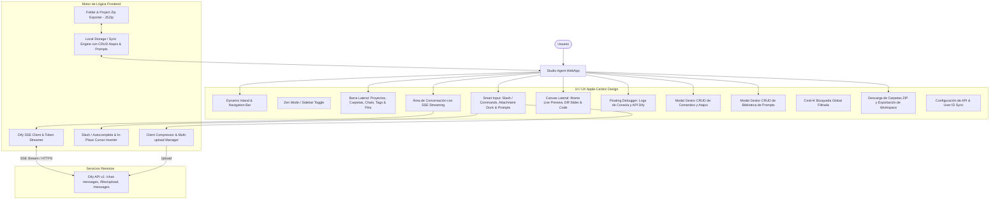

# PROJECT MAP - STUDIO AGENT CLIENT (APPLE-CENTRIC AI WORKSPACE)

## Arquitectura del Sistema (Mermaid Graph)

## Componentes y Módulos
1. **Dynamic Island & Header:** Notificaciones de estado reactivas, contador de tokens y cambio de temas.
2. **Sidebar:** Estructura jerárquica con descarga instantánea individual de carpetas/proyectos en ZIP, anclajes y tags.
3. **Smart Input & Slash Interceptor:**
   - Menú flotante al tipear `/` con filtrado en tiempo real según caracteres subsiguientes.
   - Inserción quirúrgica del comando en la posición exacta del cursor sin borrar el texto existente.
   - Barra de atajos rápidos personalizable con acceso a gestión y edición.
4. **Biblioteca de Prompts y Templates (CRUD Completo):**
   - Modal con creación, edición en vivo y eliminación de templates.
   - Botón "Usar en Chat" para inserción directa en el cursor sin perder texto previo.
5. **Gestor de Atajos y Comandos (CRUD Completo):**
   - Creación y edición de nombres de comando `/...` y descripciones.
6. **Descarga de Carpetas y Proyectos:**
   - Empaquetado instantáneo con JSZip preservando nombres y metadatos JSON.
7. **Canvas Lateral:** Vista previa multi-resolución (Desktop 1920px, Tablet 768px, Mobile 375px), slider Antes/Después y visor de código.
